<div align="center">
  

# TLS Certificate Validator

A lightweight Chrome extension for inspecting the TLS certificate and connection security details of the active HTTPS page.


</div>

## Overview

TLS Certificate Validator is an educational browser extension that uses Chrome's `debugger` API and the Chrome DevTools Protocol (CDP) to inspect TLS metadata for the active page. It summarizes certificate validity dates, hostname coverage, self-signed indicators, Certificate Transparency (CT) compliance, Chrome's reported security state, and connection details such as the negotiated protocol and cipher suite.

The project was originally created for a university **Computer Security and Privacy** course and has since been cleaned up and documented as a portfolio project.

> [!IMPORTANT]
> This extension is an educational inspection tool, not a replacement for Chrome's built-in certificate validation or a full PKI verification library. See [Security & Limitations](./docs/SECURITY_AND_LIMITATIONS.md).

## Features

- Checks whether the certificate is currently within its validity period.
- Matches the active hostname against certificate Subject Alternative Names (SANs), including standard single-label wildcard names such as `*.example.com`.
- Flags certificates that appear self-signed based on matching issuer and subject names.
- Reports Chrome's Certificate Transparency policy result.
- Reports Chrome's security state for the main document response.
- Displays issuer, subject, SANs, validity dates, TLS protocol, key exchange, cipher, and additional connection metadata when available.
- Uses a compact, modern popup UI with clear pass, warning, and fail states.
- Requests only the permissions used by the current implementation.

## How It Works

```mermaid
flowchart LR
    A[User opens extension] --> B[Popup requests active tab]
    B --> C[Background service worker]
    C --> D[chrome.debugger attaches to tab]
    D --> E[CDP Network domain enabled]
    E --> F[Page reload]
    F --> G[Main document responseReceived]
    G --> H[Read securityDetails]
    H --> I[Run educational checks]
    I --> J[Render result in popup]
```



The extension listens for the main document's `Network.responseReceived` event after enabling the CDP Network domain. Chrome supplies the certificate and transport metadata used by the validator; the extension does not independently download or build the certificate chain.

For a deeper walkthrough, see [Architecture](./docs/ARCHITECTURE.md) and [Validation Logic](./docs/VALIDATION.md).

## Installation

### 1. Clone the repository

```bash
git clone https://github.com/Zeyad-Karim/TLS-Certificate-Validator-Extension.git
cd TLS-Certificate-Validator-Extension
```

You can also download the repository as a ZIP and extract it.

### 2. Load the extension in Chrome

1. Open `chrome://extensions/`.
2. Enable **Developer mode**.
3. Click **Load unpacked**.
4. Select the `extension/` directory from this repository.
5. Pin **TLS Certificate Validator** from Chrome's extensions menu if you want quick access.

See [Installation & Troubleshooting](./docs/INSTALLATION.md) for more detail.

## Usage

1. Open an HTTPS website.
2. Click the **TLS Certificate Validator** extension icon.
3. Click **Inspect certificate**.
4. The page reloads once while the extension captures the main document's TLS metadata.
5. Review the overall assessment, individual checks, and certificate details.

The extension cannot inspect Chrome-internal pages such as `chrome://extensions/`, and another active debugger or DevTools attachment may prevent it from attaching to a tab.

## Project Structure

```text
.
├── extension/
│   ├── background.js        # CDP capture and validation logic
│   ├── icon.png             # Extension icon
│   ├── manifest.json        # Manifest V3 configuration
│   ├── popup.css            # Popup styles
│   ├── popup.html           # Popup markup
│   └── popup.js             # Popup behavior and rendering
├── docs/
│   ├── ARCHITECTURE.md
│   ├── INSTALLATION.md
│   ├── SECURITY_AND_LIMITATIONS.md
│   └── VALIDATION.md
├── .github/
│   ├── ISSUE_TEMPLATE/
│   ├── workflows/
│   └── PULL_REQUEST_TEMPLATE.md
├── .gitignore
├── CHANGELOG.md
├── CONTRIBUTING.md
└── README.md
```

## Permissions

| Permission | Why it is needed |
| --- | --- |
| `activeTab` | Gives temporary access to the current tab after the user opens the extension. |
| `debugger` | Allows the extension to attach to the tab and read Chrome DevTools Protocol network security details. |

The extension does **not** request persistent `<all_urls>` host access and does not use `webRequest` or script injection.

## What the Assessment Means

The popup combines a small set of educational checks into one summary. A passing result means the captured main-document response had:

- a certificate within its validity window;
- a SAN that matches the final HTTPS hostname;
- no obvious self-signed issuer/subject match;
- no explicit CT non-compliance result; and
- a `secure` security state reported by Chrome.

This should be read as **"no issue detected by these checks"**, not as an independent cryptographic proof of trust.

## Documentation

- [Installation & Troubleshooting](./docs/INSTALLATION.md)
- [Architecture](./docs/ARCHITECTURE.md)
- [Validation Logic](./docs/VALIDATION.md)
- [Security & Limitations](./docs/SECURITY_AND_LIMITATIONS.md)
- [Changelog](./CHANGELOG.md)
- [Contributing](./CONTRIBUTING.md)

## Contributors

Originally developed as a team project by:

- Hamza Ibrahim
- Abdelrahman Ahmed
- Youssef Mohamed
- Zeyad Karim

## Project Context

This repository began as coursework for a **Computer Security and Privacy** university course. The current repository presentation, documentation, UI, and maintenance structure have been updated to make the project easier to understand, run, review, and extend.

## Future Improvements

Potential next steps include independent certificate-chain verification, revocation checking, certificate export, richer SCT inspection, automated tests for certificate edge cases, and packaging for the Chrome Web Store.
