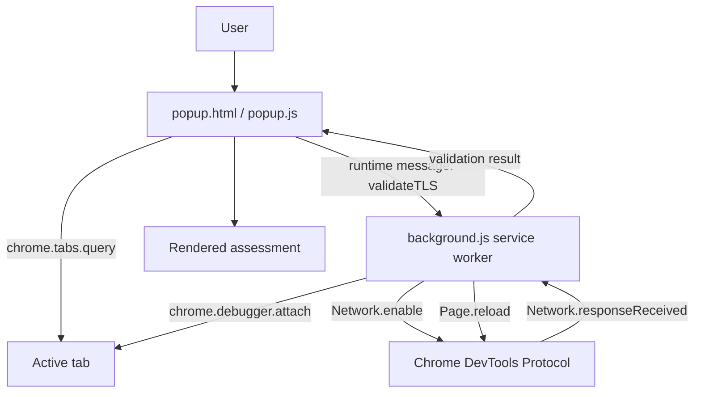

# Architecture

## Overview

TLS Certificate Validator is intentionally small. It is a Manifest V3 Chrome extension with two runtime components:

- a **popup** that handles user interaction and renders results; and
- a **background service worker** that attaches to the active tab through `chrome.debugger` and consumes Chrome DevTools Protocol (CDP) network events.

There is no backend service, database, analytics SDK, or third-party runtime dependency.

## Component Diagram

## Runtime Flow

1. The user opens the extension popup. Opening the popup is a user gesture that enables the temporary `activeTab` permission for the current tab.
2. `popup.js` queries the active tab and rejects non-HTTPS pages early.
3. The popup sends `{ action: "validateTLS", tabId }` to the background service worker.
4. `background.js` attaches to the tab with `chrome.debugger` using CDP protocol version `1.3`.
5. The service worker enables the CDP `Network` domain.
6. The service worker reloads the page.
7. It waits for the main document's `Network.responseReceived` event.
8. When `response.securityDetails` is present, the worker evaluates the captured metadata.
9. The debugger event listener is removed, the debugger is detached, and the result is returned to the popup.
10. The popup renders the summary, check list, SANs, and connection metadata using DOM APIs and `textContent`.

## Main Files

### `extension/manifest.json`

Defines the Manifest V3 extension, popup, service worker, icon, and required permissions.

### `extension/background.js`

Owns all CDP interaction and TLS assessment logic. Important responsibilities include:

- debugger lifecycle management;
- inspection timeout handling;
- filtering for the main `Document` response;
- SAN hostname matching;
- certificate date checks;
- self-signed heuristics;
- Certificate Transparency interpretation; and
- packaging certificate/connection details for the popup.

### `extension/popup.js`

Owns the user interaction and rendering layer. It deliberately avoids interpolating certificate fields into `innerHTML`; captured values are rendered with `textContent` to reduce DOM injection risk.

### `extension/popup.css`

Contains the visual system for the popup, including status colors, result cards, certificate detail rows, accessibility focus states, and reduced-motion handling.

## Permission Model

The extension currently requests only:

- `activeTab` — temporary access to the tab after an explicit user gesture; and
- `debugger` — required by `chrome.debugger` to attach to the target and read CDP network information.

It does not need persistent `<all_urls>` host permissions, `scripting`, or `webRequest` for the current implementation.

## Data Flow & Privacy

TLS metadata stays inside the extension runtime. The project does not send certificate information to a remote server. See [Security & Limitations](./SECURITY_AND_LIMITATIONS.md) for the exact scope and caveats.
